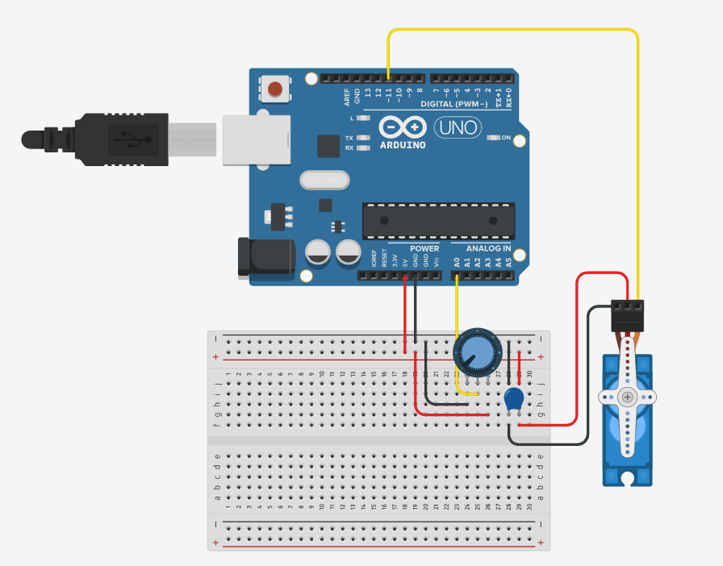
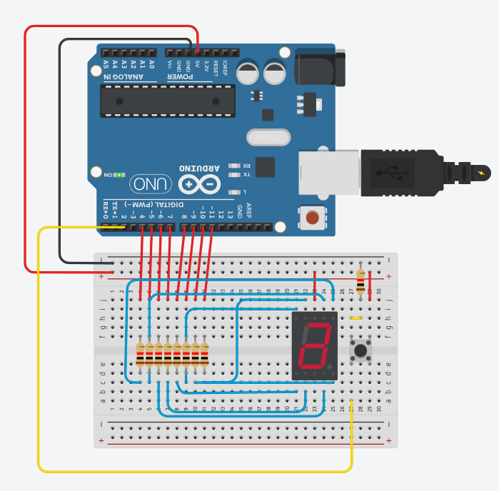
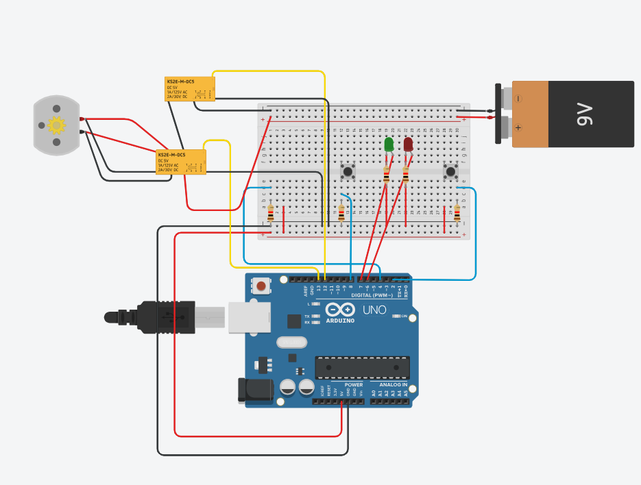

# Atividades-IOT

# Aula 02
## Desafio sem arduino 


## Desafio com arduino 

```
int sensorLuminosidade = A0;
int led = 9;

void setup() {
  pinMode(led, OUTPUT);
}

void loop() {
  int nivelDeLuz = analogRead(sensorLuminosidade);

  nivelDeLuz = map(nivelDeLuz, 0, 900, 255, 0);
  nivelDeLuz = constrain(nivelDeLuz, 0, 255);

  analogWrite(led, nivelDeLuz);
}

```


# Aula 03
## Desafio 01

```

int led1 = 10;
int led2 = 9;
int led3 = 8;

int led4 = 13;
int led5 = 12;
int led6 = 11;


void setup() {
  pinMode(led1, OUTPUT);
  pinMode(led2, OUTPUT);
  pinMode(led3, OUTPUT);

  pinMode(led4, OUTPUT);
  pinMode(led5, OUTPUT);
  pinMode(led6, OUTPUT);
}

void loop() {
  digitalWrite(led4, HIGH);
  digitalWrite(led5, LOW);
  digitalWrite(led6, LOW);

  digitalWrite(led3, HIGH);
  digitalWrite(led2, LOW);
  digitalWrite(led1, LOW);

  delay(5000);


  digitalWrite(led4, LOW);
  digitalWrite(led5, HIGH);

  delay(2000);

  
  digitalWrite(led5, LOW);
  digitalWrite(led6, HIGH);

  digitalWrite(led3, LOW);
  digitalWrite(led1, HIGH);

  delay(5000);
  
  digitalWrite(led1, LOW);
  digitalWrite(led2, HIGH);

  delay(2000);

  
  digitalWrite(led2, LOW);
  digitalWrite(led3, HIGH);

  digitalWrite(led6, LOW);
}
```
## Desafio 02

```

int sensorLuminosidade = A0;

int leds[] = {2, 3, 4, 5, 6, 7, 8, 9, 10, 11};

void setup() {
  for (int i = 0; i < 10; i++) {
    pinMode(leds[i], OUTPUT);
  }
}

void loop() {

  int nivelDeLuz = analogRead(sensorLuminosidade);

  int quantidadeLeds = map(nivelDeLuz, 0, 900, 10, 0);

  quantidadeLeds = constrain(quantidadeLeds, 0, 10);

  for (int i = 0; i < 10; i++) {

    if (i < quantidadeLeds) {
      digitalWrite(leds[i], HIGH);
    } else {
      digitalWrite(leds[i], LOW);
    }

  }

  delay(50);
}
```

# Aula 04

```
#include <Servo.h>

Servo servo;

int potenc = 0;
int angulo = 0;

void setup(){
  servo.attach(11);
}

void loop() {
  potenc = analogRead(0);
  angulo = map(potenc, 0, 1023, 0, 180);
  servo.write(angulo);
  
  delay(15);
}
```

```
int a = 4;
int b = 5;
int c = 6;
int d = 7;
int e = 8;
int f = 9;
int g = 10;

int botao = 2;
int num = 0;

int entrada[7] = {a, b, c, d, e, f, g};

int display[10][7] = {
  {1, 1, 1, 1, 1, 1, 0},
  {0, 1, 1, 0, 0, 0, 0},
  {1, 1, 0, 1, 1, 0, 1},
  {1, 1, 1, 1, 0, 0, 1},
  {0, 1, 1, 0, 0, 1, 1},
  {1, 0, 1, 1, 0, 1, 1},
  {1, 0, 1, 1, 1, 1, 1},
  {1, 1, 1, 0, 0, 0, 0},
  {1, 1, 1, 1, 1, 1, 1},
  {1, 1, 1, 1, 0, 1, 1}
};

void setup() {

  for (int i = 0; i < 7; i++) {
    pinMode(entrada[i], OUTPUT);
  }

  pinMode(botao, INPUT);

  numero(0);
}

void loop() {

  int click = digitalRead(botao);

  if (click == HIGH) {

    num++;

    if (num >= 10) {
      num = 0;
    }

    numero(num);

    delay(300);
  }
}

void numero(int coluna) {

  for (int i = 0; i < 7; i++) {

    if (display[coluna][i] == 1) {
      digitalWrite(entrada[i], LOW);
    } else {
      digitalWrite(entrada[i], HIGH);
    }
  }
}
```

# Desafio do simulador de portão eletrônico


```
int relePower = 12;
int releDirecao = 13;

int botaoControle = 2;
int fimCursoAberto = 3;
int fimCursoFechado = 4;

bool portaoAberto = false;
bool motorLigado = false;

int ledVermelho = 6;
int ledVerde = 7;

unsigned long tempoAnteriorLed = 0;
const long intervaloLed = 500;
bool estadoLed = false;

void setup() {

  pinMode(relePower, OUTPUT);
  pinMode(releDirecao, OUTPUT);

  pinMode(botaoControle, INPUT);
  pinMode(fimCursoAberto, INPUT);
  pinMode(fimCursoFechado, INPUT);

  pinMode(ledVermelho, OUTPUT);
  pinMode(ledVerde, OUTPUT);
}

void loop() {

  controlarPortao();
  piscarLeds();
}

void controlarPortao() {

  if (digitalRead(botaoControle) == HIGH && !motorLigado) {

    digitalWrite(releDirecao, portaoAberto ? LOW : HIGH);
    digitalWrite(relePower, HIGH);

    motorLigado = true;

    delay(300);
  }

  if (digitalRead(fimCursoAberto) == HIGH) {

    digitalWrite(relePower, LOW);

    motorLigado = false;
    portaoAberto = true;
  }

  if (digitalRead(fimCursoFechado) == HIGH) {

    digitalWrite(relePower, LOW);

    motorLigado = false;
    portaoAberto = false;
  }
}

void piscarLeds() {

  unsigned long agora = millis();

  if (agora - tempoAnteriorLed >= intervaloLed) {

    estadoLed = !estadoLed;

    digitalWrite(ledVermelho, estadoLed);
    digitalWrite(ledVerde, !estadoLed);

    tempoAnteriorLed = agora;
  }
}
```
