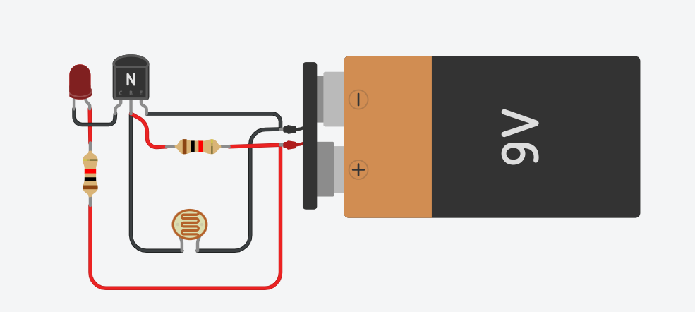
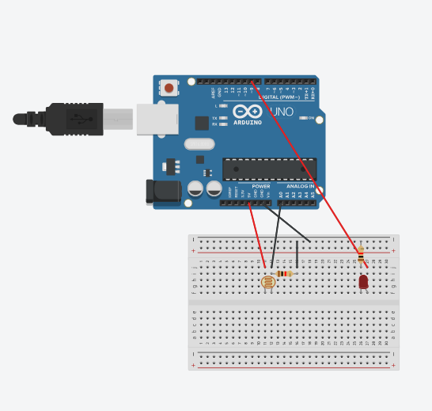
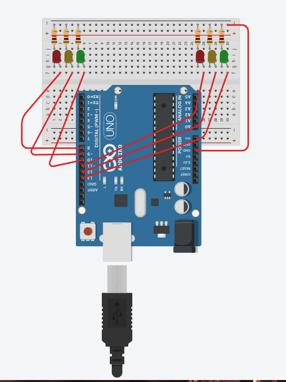
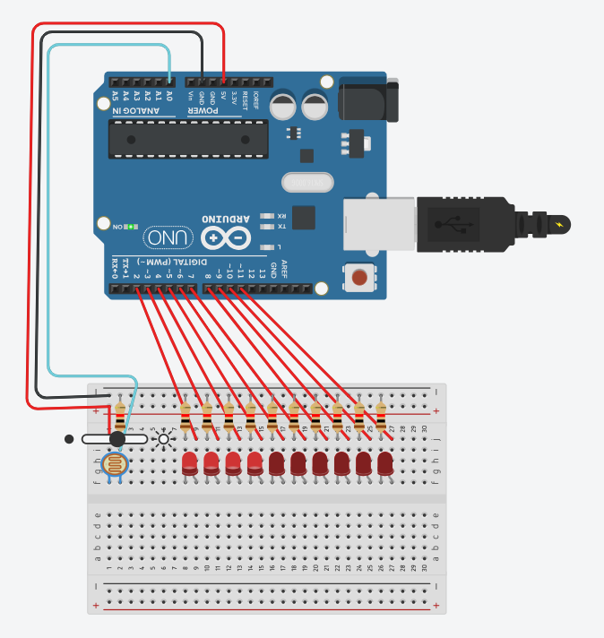

# Atividades-IOT

# Aula 02
## Desafio sem arduino 


## Desafio com arduino 

```
int sensorLuminosidade = A0;
int led = 9;

void setup() {
  pinMode(led, OUTPUT);
}

void loop() {
  int nivelDeLuz = analogRead(sensorLuminosidade);

  nivelDeLuz = map(nivelDeLuz, 0, 900, 255, 0);
  nivelDeLuz = constrain(nivelDeLuz, 0, 255);

  analogWrite(led, nivelDeLuz);
}

```


# Aula 03
## Desafio 01

```

int led1 = 10;
int led2 = 9;
int led3 = 8;

int led4 = 13;
int led5 = 12;
int led6 = 11;


void setup() {
  pinMode(led1, OUTPUT);
  pinMode(led2, OUTPUT);
  pinMode(led3, OUTPUT);

  pinMode(led4, OUTPUT);
  pinMode(led5, OUTPUT);
  pinMode(led6, OUTPUT);
}

void loop() {
  digitalWrite(led4, HIGH);
  digitalWrite(led5, LOW);
  digitalWrite(led6, LOW);

  digitalWrite(led3, HIGH);
  digitalWrite(led2, LOW);
  digitalWrite(led1, LOW);

  delay(5000);


  digitalWrite(led4, LOW);
  digitalWrite(led5, HIGH);

  delay(2000);

  
  digitalWrite(led5, LOW);
  digitalWrite(led6, HIGH);

  digitalWrite(led3, LOW);
  digitalWrite(led1, HIGH);

  delay(5000);
  
  digitalWrite(led1, LOW);
  digitalWrite(led2, HIGH);

  delay(2000);

  
  digitalWrite(led2, LOW);
  digitalWrite(led3, HIGH);

  digitalWrite(led6, LOW);
}
```
## Desafio 02

```

int sensorLuminosidade = A0;

int leds[] = {2, 3, 4, 5, 6, 7, 8, 9, 10, 11};

void setup() {
  for (int i = 0; i < 10; i++) {
    pinMode(leds[i], OUTPUT);
  }
}

void loop() {

  int nivelDeLuz = analogRead(sensorLuminosidade);

  int quantidadeLeds = map(nivelDeLuz, 0, 900, 10, 0);

  quantidadeLeds = constrain(quantidadeLeds, 0, 10);

  for (int i = 0; i < 10; i++) {

    if (i < quantidadeLeds) {
      digitalWrite(leds[i], HIGH);
    } else {
      digitalWrite(leds[i], LOW);
    }

  }

  delay(50);
}
```
